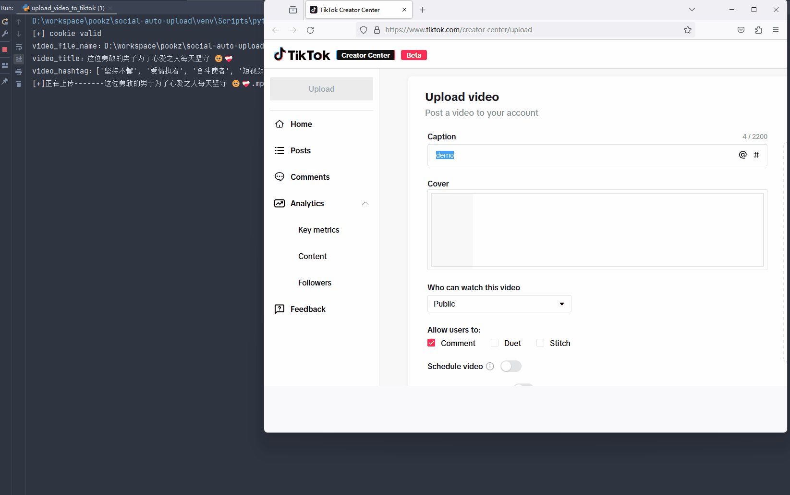

# GEO 智能内容分发平台

这是一个基于 **OmniPost** uploader 能力构建的 GEO 内容生产与自动分发平台：品牌资料进入系统后，可完成 AI 内容生成、规则型 GEO Score、AI 优化、多平台即时/定时发布和结果追踪。原项目的视频、图文 uploader、Web 账号管理和统一 CLI（`sau`）继续保留。

当前二开版本在保留原 uploader 与 CLI 的基础上，增加了品牌项目、AI 内容生成、GEO Score、内容库、统一发布任务、Demo Mode 和定时发布链路。新业务模块与原 uploader 解耦，真实平台仍需人工登录并遵守平台验证流程。

> 本仓库基于 [rehatRobot/omnipost](https://github.com/rehatRobot/omnipost) 二开；该项目源自 [dreammis/social-auto-upload](https://github.com/dreammis/social-auto-upload)。感谢原作者与社区贡献者。



## 赞助商

<table width="100%">
  <tr>
    <td width="25%" align="center" valign="middle">
      <a href="https://api.rehat.cn/">
        <strong>Rehat API</strong>
      </a>
    </td>
    <td width="75%" align="left" valign="middle">
      <a href="https://api.rehat.cn/">Rehat API</a>：稳定好用的 AI 大模型中转站。一套接口打通 Claude、GPT、Gemini、DeepSeek、通义等主流模型，兼容 OpenAI 协议，OpenClaw、Claude Code、Codex、Cherry Studio 等工具可直接接入。按量计费、延迟低、适合日常开发与自媒体 Agent 场景。
      <a href="https://api.rehat.cn/">https://api.rehat.cn/</a>
    </td>
  </tr>
</table>

---

## 目录

- [赞助商](#赞助商)
- [功能特性](#功能特性)
- [架构概览](#架构概览)
- [环境要求](#环境要求)
- [安装](#安装)
- [在线演示与部署边界](#在线演示与部署边界)
- [快速开始](#快速开始)
- [平台能力](#平台能力)
- [配置说明](#配置说明)
- [文档索引](#文档索引)
- [AI Agent](#ai-agent)
- [免责声明](#免责声明)
- [贡献](#贡献)
- [致谢](#致谢)
- [许可证](#许可证)

## 功能特性

- **多平台发布**：抖音、B 站、小红书、快手、视频号、百家号、今日头条、搜狐号、知乎、TikTok 等
- **视频 + 图文**：部分平台支持图文 / 文章（见能力表）
- **账号与 Cookie 管理**：Web 扫码 / 导入 Cookie，CLI `login` / `check`
- **定时发布**：多数平台支持（以各平台后台能力为准）
- **统一 CLI**：`sau <platform> <action>`，便于脚本化与 Agent 调用
- **可扩展 uploader**：每个平台独立模块，便于二开接入新平台
- **GEO 内容工作流**：品牌底稿 → AI 生成 → GEO 评分/优化 → 内容库 → 多渠道分发
- **可追踪发布任务**：`queued / processing / success / failed / need_action / scheduled`
- **安全 Demo Mode**：完整执行任务状态链，但明确标记为演示且不访问真实平台

为什么还需要这种项目：上传是高频、重复、流程固定的工作。与其每次让通用 Browser Agent 临场解析页面，不如把已验证的发布链路固化成脚本 / CLI / Web 任务。

## 架构概览

| 部分 | 说明 |
| --- | --- |
| `sau_backend.py` | Flask API：账号、素材、发布任务 |
| `sau_frontend/` | Vue3 + Element Plus 管理台（账号 / 素材 / 发布中心） |
| `services/` | GEO 评分、AI、项目/文章、发布适配器、执行器与调度服务 |
| `uploader/*` | 各平台 Playwright / 专用运行时上传实现 |
| `sau_cli.py` | 统一 CLI 入口（安装后命令为 `sau`） |
| `examples/` | 单平台登录 / 上传示例脚本 |
| `skills/` | 面向 Agent 的平台 Skill（抖音 / 快手 / 小红书 / B 站） |
| `db/` | SQLite 账号与文件元数据 |

## 环境要求

- Python **3.10+**（推荐 3.11）
- Node.js **18+**（仅使用 Web 前端时需要）
- Windows / macOS / Linux
- 推荐使用 [`uv`](https://github.com/astral-sh/uv) 管理依赖

## 安装

详细步骤见：[安装说明](./docs/install.md) · [更新说明](./docs/update.md)

### 1. 克隆与 Python 依赖

```bash
git clone https://github.com/rainy321/geo-content-distribution-platform.git
cd geo-content-distribution-platform

uv venv
# Windows
.venv\Scripts\activate
# Linux / macOS
# source .venv/bin/activate

uv pip install -e .

# 使用 Web 管理台时安装 Web 可选依赖
uv pip install -e ".[web]"
```

安装后可直接使用 `sau` 命令；为兼容原 uploader 与脚本生态，CLI 入口名保持不变。

### 2. 浏览器驱动

主线使用 `patchright`（兼容 Playwright API）：

```powershell
# Windows 国内镜像示例
$env:PLAYWRIGHT_DOWNLOAD_HOST="https://npmmirror.com/mirrors/playwright"
patchright install chromium
```

部分平台 / 示例仍可能使用 `playwright`，可按需补充：

```bash
playwright install chromium
```

### 3. 配置与数据库

```bash
python db/createTable.py
```

`conf.py` 只包含可公开的默认值；本地 Chrome 路径、无头模式等通过 `LOCAL_CHROME_PATH`、`LOCAL_CHROME_HEADLESS`、`DEBUG_MODE` 环境变量覆盖。**不要**把 `.env`、`cookies/`、`cookiesFile/`、`database.db` 提交到公开仓库。

### 4. Web 前后端（可选）

```bash
# 后端
python sau_backend.py
# 默认 http://localhost:5409

# 前端
cd sau_frontend
npm ci
npm run dev
# 默认 http://localhost:5173
```

Windows 在完成依赖安装后也可双击 `start-win.bat`。脚本会从仓库目录启动并优先使用 `.venv`，只在未显式配置时启用 Demo 数据、关闭真实发布，前后端均只对本机开放。

本地演示建议显式开启 Demo Mode：

```powershell
# PowerShell
$env:DEMO_MODE="true"
python sau_backend.py
```

```bash
# Linux / macOS
DEMO_MODE=true python sau_backend.py
```

Demo Mode 首次连接到**完全空的数据库**时，会在一个事务内准备“XX科技（示例数据）”、6 篇带“示例数据”标签的文章，以及覆盖成功、失败、等待确认和计划中状态的演示发布历史。重复启动不会重复写入；只要数据库里已有任意项目、文章或发布任务，种子服务就会跳过，不会把样例混进用户数据。可通过 `SEED_DEMO_DATA=false` 单独关闭这一行为。

## 在线演示与部署边界

Vercel 生产地址：[https://geo-content-distribution-platform.vercel.app](https://geo-content-distribution-platform.vercel.app)

这是真实可访问的 GEO 管理台与 Demo API 部署，但不是云端媒体发布 Worker。线上固定使用 `DEMO_MODE=true`、`ALLOW_REAL_PUBLISHING=false`，不保存本地账号 Cookie，也不打包 Playwright、Patchright 和 OpenCV。SQLite、素材和示例数据位于 Vercel 函数的临时目录，实例重建后可能重置；默认 AI 连接已通过 Vercel Production 环境变量配置，密钥类型为 Secret。真实媒体登录和发布继续由本地浏览器 Worker 执行。

当前在线演示启用了单运营者访问口令：口令只在部署环境中保存，验证成功后由后端签发 HttpOnly、SameSite=Lax 的短期会话 Cookie。AI 生成、优化和登录尝试默认使用进程内限流；配置 Upstash Redis 的两个 REST Secret 后会自动切换为跨实例原子计数，供应商暂时不可用时退回已预热的本地安全网。接入真实业务数据前，仍必须增加持久数据库/对象存储；云端真实媒体发布还需要独立长驻 Worker，且不得把媒体 Cookie 或模型密钥写进仓库或前端变量。

### 生产访问控制与独立 Worker

同时配置 `APP_ACCESS_PASSWORD` 和 `APP_SESSION_SECRET` 即可启用轻量访问门；只配置口令但缺少会话密钥时，后端会拒绝启动，避免误以为站点已受保护。该机制面向单一运营者和 MVP 演示，不是多用户权限系统。

如果 Web 与调度器运行在同一台受控机器，保持 `RUN_PUBLISH_SCHEDULER=true` 即可。拆成独立进程时，Web 设置为 `RUN_PUBLISH_SCHEDULER=false`，再启动：

```bash
# 启动前自检；不会打开或访问任何发布平台
sau-worker --check

sau-worker

# 只处理一批到期任务，适合外部 Cron
sau-worker --once
```

`--check` 会验证数据库、Cookie/素材目录、已连接账号数量，以及真实模式所需的浏览器运行时；它只做本地准备与检查，不会访问知乎等发布平台。Worker 继续复用同一套 SQLite、素材目录、Cookie 目录、授权指纹和 PublisherAdapter。Web 与 Worker 必须挂载同一份持久数据；在没有持久存储的 Vercel 函数中不要启动媒体 Worker。

### 6. Docker Compose 本地演示

仓库提供 [`compose.yaml`](./compose.yaml)，默认只绑定本机 `127.0.0.1:5409`、开启 Demo Mode、关闭真实发布，并为 SQLite、Web Cookie 和媒体文件使用独立持久卷：

```bash
docker compose up --build -d
docker compose ps
```

健康检查地址为 `http://127.0.0.1:5409/api/health`。首次构建需要下载 Python、Node 和 Chromium 依赖；当前 Compose 配置用于本机或受控内网演示，不是可直接暴露公网的生产安全配置。停止服务使用 `docker compose down`；不要附加 `-v`，除非确定要删除本地演示数据库、Cookie 和媒体持久卷。

## 快速开始

### 方式 A：Web 发布中心

1. 启动后端 + 前端
2. 在「品牌项目」维护品牌事实和核心关键词
3. 使用「AI 内容创作」生成稿件，在「内容库」标记为就绪
4. 在「发布中心」选择稿件与多个平台，创建即时或定时任务
5. Demo Mode 会自动完成演示任务；真实发布需要先在「媒体账号」完成人工登录

适合日常运营与多账号可视化管理。

### GEO Web API

| 方法 | 路径 | 说明 |
| --- | --- | --- |
| `POST` | `/api/articles/generate` | 通过 OpenAI-compatible API 生成 GEO 稿件 |
| `GET/POST` | `/api/auth/status`、`/api/auth/login` | 查询访问门状态、建立 HttpOnly 运营会话 |
| `POST` | `/api/auth/logout` | 退出当前运营会话 |
| `POST` | `/api/geo/score` | 计算规则型 GEO Score |
| `POST/GET` | `/api/projects` | 创建或查询品牌项目 |
| `POST/GET` | `/api/articles` | 保存或查询文章 |
| `POST` | `/api/publish` | 为一个文章和平台创建发布任务 |
| `GET` | `/api/publish/jobs` | 查询发布任务与历史 |
| `GET` | `/api/publish/jobs/:id` | 轮询单个任务状态 |
| `POST` | `/api/publish/jobs/:id/retry` | 将失败/待人工任务重新排队 |
| `POST` | `/api/publish/jobs/:id/execute` | 仅执行明确标记的 Demo 任务 |
| `POST` | `/api/publish/jobs/:id/execute-real` | 三重门控后执行已确认的知乎、今日头条、搜狐号、百家号或小红书真实任务 |
| `GET` | `/api/media-accounts` | 读取媒体账号与平台连接概览，不主动检测平台 |
| `POST` | `/api/media-accounts/:id/check` | 用户显式触发单账号 Cookie 状态检测 |

多平台分发会为每个平台创建一条独立任务。一个平台失败不会阻塞其他平台，验证码、扫码、Cookie 失效、风控和页面结构变化统一进入 `need_action`，不会尝试绕过平台验证。

### 方式 B：CLI（当前已接入平台）

```bash
sau douyin login --account <account_name>
sau douyin check --account <account_name>
sau douyin upload-video --account <account_name> --file videos/demo.mp4 --title "示例标题" --desc "示例简介"
sau douyin upload-note --account <account_name> --images videos/1.png videos/2.png --title "图文标题" --note "图文正文"

sau kuaishou login --account <account_name>
sau kuaishou upload-video --account <account_name> --file videos/demo.mp4 --title "示例标题"

sau xiaohongshu login --account <account_name>
sau xiaohongshu upload-note --account <account_name> --images videos/1.png videos/2.png --title "图文标题" --note "正文"

sau bilibili login --account <account_name>
sau bilibili upload-video --account <account_name> --file videos/demo.mp4 --title "示例标题" --tid 249
```

更多说明：[CLI 使用说明](./docs/CLI.md)

约定简述：

- `account_name` 是你自定义的账号名，对应 `cookies/<platform>_uploader/<account_name>.json`
- 视频元数据常用：`title + desc + tags`
- 图文元数据常用：`title + note + tags`
- B 站首次相关命令会自动准备 `biliup`；登录建议在本地真实终端执行

### 方式 C：examples 脚本

适合调试单平台 uploader（头条 / 搜狐 / 知乎 / 百家号图文等尚未全部 CLI 化时，优先用此方式或 Web）：

```bash
# 登录示例
python examples/get_toutiao_cookie.py
python examples/get_sohu_cookie.py
python examples/get_zhihu_cookie.py

# 发布示例（按脚本内注释修改路径与文案）
python examples/upload_article_to_toutiao.py
python examples/upload_article_to_sohu.py
python examples/upload_article_to_zhihu.py
python examples/upload_article_to_baijiahao.py
```

抖音 / 快手 / 小红书 / B 站优先用 `sau ...`，不必再走旧示例主路径。

## 平台能力

| 平台 | 登录 | 视频 | 图文/文章 | 定时 | CLI | Skill | 备注 |
| --- | --- | --- | --- | --- | --- | --- | --- |
| 抖音 | ✅ | ✅ | ✅ | ✅ | ✅ | ✅ | CLI/Skill 最完整 |
| Bilibili | ✅ | ✅ | ❌ | ✅ | ✅ | ✅ | 依赖 `biliup` 运行时 |
| 小红书 | ✅ | ✅ | ✅ | ✅ | ✅ | ✅ | 浏览器自动化 |
| 快手 | ✅ | ✅ | ✅ | ✅ | ✅ | ✅ | 浏览器自动化 |
| 视频号 | ✅ | ✅ | ❌ | ✅ | ❌ | ❌ | `tencent_uploader` |
| 百家号 | ✅ | ✅ | ✅ | ✅ | ❌ | ❌ | Web / examples |
| 今日头条 | ✅ | ✅ | ✅ | ✅ | ❌ | ❌ | 图文为「发文章」，非微头条 |
| 搜狐号 | ✅ | ❌ | ✅ | ✅ | ❌ | ❌ | 仅图文；标题 5–72 字；封面 **大于 450×300**，jpg/jpeg/png，≤10MB |
| 知乎 | ✅ | ❌ | ✅ | ✅ | ❌ | ❌ | 第一期仅文章 |
| TikTok | ✅ | ✅ | ❌ | ✅ | ❌ | ❌ | 示例偏 Chrome 版实现 |

平台后台改版、风控、账号权限（如实名）会导致自动化失效，属正常现象，需要跟进维护选择器与流程。

## 配置说明

- 运行配置：[`conf.py`](./conf.py) 提供安全默认值，使用环境变量覆盖本地差异
- Cookie 目录：`cookies/`（CLI / 示例）与 `cookiesFile/`（Web 账号）
- 素材目录：常见为 `videoFile/`（以后端实际配置为准）
- 日志：`logs/`

GEO Web 运行环境变量：

可从 [`.env.example`](./.env.example) 查看无敏感值模板；当前应用不会自动读取 `.env`，请在启动进程或部署平台中显式设置变量。

| 变量 | 默认值 | 用途 |
| --- | --- | --- |
| `AI_BASE_URL` | 无 | OpenAI-compatible API 地址 |
| `AI_API_KEY` | 无 | 模型 API Key，禁止写入仓库 |
| `AI_MODEL` | 无 | 内容生成与优化使用的模型 |
| `APP_ACCESS_PASSWORD` | 空 | 运营访问口令；与 `APP_SESSION_SECRET` 同时配置时启用访问门 |
| `APP_SESSION_SECRET` | 空 | Flask 会话签名密钥；必须是独立随机 Secret |
| `APP_SESSION_HOURS` | `12` | 运营会话有效小时数，范围 1–168 |
| `AUTH_LOGIN_ATTEMPTS_PER_MINUTE` | `5` | 单客户端每分钟口令尝试上限 |
| `AI_RATE_LIMIT_PER_MINUTE` | `0` | 单客户端每分钟 AI 请求上限；0 表示应用内限流关闭，生产建议显式配置 |
| `UPSTASH_REDIS_REST_URL` | 空 | 可选的 Upstash Redis REST 地址；与 Token 同时配置后启用跨实例限流 |
| `UPSTASH_REDIS_REST_TOKEN` | 空 | 可选的 Upstash 标准 REST Token，只允许放在服务端 Secret 中 |
| `CORS_ALLOWED_ORIGINS` | 本地 5173 两个回环地址 | 分离部署时允许携带会话凭据的前端来源，逗号分隔 |
| `SESSION_COOKIE_SECURE` | Vercel 自动开启 | 是否只通过 HTTPS 发送运营会话 Cookie |
| `LOCAL_CHROME_PATH` | 空 | 可选的本机 Chrome 可执行文件路径 |
| `LOCAL_CHROME_HEADLESS` | `true` | uploader 默认是否使用无头浏览器；人工登录时会按登录流程打开可见窗口 |
| `DEBUG_MODE` | `false` | uploader 调试日志开关 |
| `XHS_SERVER` | `http://127.0.0.1:11901` | 仅供小红书旧流程兼容使用 |
| `DEMO_MODE` | `false` | 为 `true` 时新发布任务使用 DemoPublisher |
| `SEED_DEMO_DATA` | `true` | Demo Mode 下为空数据库准备幂等、明确标注的演示数据 |
| `ALLOW_REAL_PUBLISHING` | `false` | 真实发布总开关；当前接入知乎、今日头条、搜狐号、百家号和小红书 |
| `DATABASE_PATH` | `db/database.db` | 可覆盖 SQLite 路径，便于隔离环境 |
| `COOKIES_DIRECTORY` | `cookiesFile` | Web 登录、账号检测和真实发布共用的 Cookie 目录 |
| `MEDIA_ROOT` | `videoFile` | 上传素材与发布图片的运行目录 |
| `PUBLISH_SCHEDULER_INTERVAL_SECONDS` | `15` | 到期任务检查间隔，最少 5 秒 |
| `RUN_PUBLISH_SCHEDULER` | `true` | Web 进程是否内置调度器；使用独立 `sau-worker` 时设为 `false` |
| `SERVER_HOST` | `127.0.0.1` | 后端监听地址；容器内需显式设为 `0.0.0.0` |
| `SERVER_PORT` | `5409` | 后端监听端口；非法值会回退到 5409 |

Web 管理台的“系统设置”支持为当前浏览器填写自定义 OpenAI-compatible API。三项填写完整时，自定义配置优先于服务器默认值；服务地址和模型名保存在浏览器本地，API Key 只放在当前标签页的 `sessionStorage`，关闭标签页后清除。自定义配置只随生成和优化请求发送，服务器状态接口不会返回密钥、地址或模型值。服务地址必须使用公开 HTTPS URL，后端拒绝本机、私网、保留地址和 URL 内嵌凭据。

定时任务由 APScheduler 在 `python sau_backend.py` 启动时注册。每次 tick 会原子地将到期任务从 `scheduled` 提升为 `queued`；Demo 任务随后自动执行。真实任务默认只进入队列；只有创建计划时用户再次明确授权自动执行、授权内容指纹到期仍匹配、真实发布总开关仍开启且账号有效时，才会调用真实适配器一次。失败或状态不明不会自动重试。调度任务启用了单实例和合并补跑，避免同一进程内重复领取。

知乎、今日头条、搜狐号、百家号和小红书的真实发布默认关闭。只有同时满足 `DEMO_MODE=false`、`ALLOW_REAL_PUBLISHING=true`、任务本身不是 Demo，并且操作者在发布中心二次确认时才会进入真实适配器。五个适配器都会先验证登录状态。知乎发布前通过当前账号的公开文章列表精确匹配标题，已存在时直接返回原链接；发布后最多轮询 3 次公开文章结果并自动对账，不会自动重复点击“发布”。其余渠道只有取得平台公开内容链接才标记 `success`；只有提交证据或发生超时但最终状态未知时保持 `processing`，要求先到平台后台核对，避免盲目重试造成重复内容。百家号文章必须由操作者提供一张展示封面，小红书图文笔记必须提供至少一张图片；当前不会自动生成或擅自选择素材。扫码、验证码、实名、风控或 Cookie 失效会进入“待人工确认”，系统不会绕过平台安全机制。

> 部署安全边界：当前 Vercel 公网站运行无媒体 Cookie、关闭真实发布的可重建 Demo，并配置服务器端 AI Secret、运营访问门和应用内 AI 限流；跨域凭据请求仅允许显式白名单来源。Vercel Serverless 实例之间不共享内存限流和 SQLite，因此持续对外服务仍应接入 Upstash/Vercel WAF 等共享限流、持久数据库与对象存储，并把媒体浏览器 Worker 隔离在受控环境，不能把本地后端和 `cookiesFile/` 直接暴露到公网。

开发回归：

```bash
uv run python -m unittest discover -s tests -v
cd sau_frontend && npm run build
```

开源或分享仓库前请确认敏感文件已被忽略，可参考 [`.gitignore`](./.gitignore)。

## 文档索引

| 文档 | 内容 |
| --- | --- |
| [docs/install.md](./docs/install.md) | 安装与环境 |
| [docs/update.md](./docs/update.md) | 更新说明 |
| [docs/CLI.md](./docs/CLI.md) | `sau` CLI |
| [docs/agent-bootstrap.md](./docs/agent-bootstrap.md) | 交给 AI Agent 的启动提示词 |
| [docs/legacy-web.md](./docs/legacy-web.md) | 历史 Web 说明 |
| [skills/*/SKILL.md](./skills) | 各平台 Agent Skill |

## AI Agent

如果你把本仓库交给 OpenClaw、Codex、Claude Code 等使用：

1. 先发送仓库 + [Agent Bootstrap Prompt](./docs/agent-bootstrap.md)  
2. 优先让 Agent 走 `uv` + `sau` + `skills/`  
3. 先验证：`douyin` / `kuaishou` / `xiaohongshu` / `bilibili` 四个 CLI 入口  

相关 Skill：

- [Douyin](./skills/douyin-upload/SKILL.md)
- [Kuaishou](./skills/kuaishou-upload/SKILL.md)
- [Xiaohongshu](./skills/xiaohongshu-upload/SKILL.md)
- [Bilibili](./skills/bilibili-upload/SKILL.md)

## 免责声明

- 本项目仅供学习、研究与个人效率提升使用。  
- 使用自动化发布可能违反部分平台用户协议，存在账号限制、验证码、功能不可用等风险，**后果由使用者自行承担**。  
- 请勿用于垃圾信息、违规内容分发或其他违法用途。  
- 平台页面与接口随时变更，不保证某一功能长期可用。

## 贡献

欢迎 Issue / PR：

1. Fork 本仓库  
2. 新建分支：`feature/xxx` 或 `fix/xxx`  
3. 提交清晰的变更说明  
4. 发起 Pull Request  

建议：改动平台自动化时附上复现步骤、日志片段（`logs/`）与是否 dry-run。

## 致谢

- 原项目：[dreammis/social-auto-upload](https://github.com/dreammis/social-auto-upload)
- B 站上传能力基于 [biliup](https://github.com/biliup/biliup) 的接入与封装
- 所有提交 Issue、PR 与反馈的贡献者
- 感谢 [LINUX DO](https://linux.do/) 社区提供的交流氛围与开源推广支持

## 许可证

本项目采用 [MIT License](./LICENSE)。

使用或二次发布时，请保留许可证与版权声明，并保留对上游项目与 `biliup` 的致谢信息。
